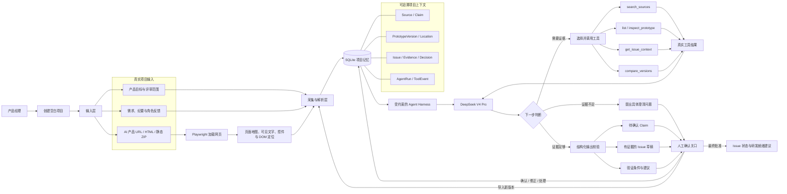

# ProtoAlign Agent 架构与真实使用流程

> 本文描述首个真实 Agent MVP。产品边界和优先级仍以根目录 `README.md` 为准。

## 输入到输出的工作循环

Agent 循环的核心不是固定执行所有工具，而是：模型根据当前目标和已获得证据选择工具；工具返回真实环境结果；模型再决定继续检索、提出澄清问题或生成结构化结果。外层 Issue 生命周期保持确定性，事实确认和问题关闭始终由产品经理完成。

## 一次完整的真实使用过程

1. **创建空白项目**
   产品经理新建项目，填写产品目标、目标用户和本次评审范围。系统中没有预置 Issue。

2. **导入真实 AI 产品**
   产品经理输入在线或本地可访问 URL，或者上传单文件 HTML / 静态构建 ZIP 作为 V1，同时上传需求、会议纪要，或手工录入客户与研发反馈。

3. **建立可检查的项目上下文**
   系统保存文本来源和原文位置；浏览器采集器打开 V1，提取真实页面、可见文案、交互控件和 DOM 定位。所有内容进入项目独立记忆。

4. **主动启动评审**
   产品经理点击“启动评审”。DeepSeek Agent 先读取项目目标，再自主选择资料检索和原型检查工具。界面显示真实工具名称、结果摘要、耗时和失败状态，不显示隐藏思维链。

5. **查看 Agent 结果**
   Agent 最多生成三条高价值 Issue。每条都说明影响、证据来源、对应版本与页面位置、需要谁确认，以及修改后的验证条件；仅凭通用常识发现的问题标记为“AI 推断·待确认”。

6. **产品经理确认与处理**
   产品经理确认或修正需求基线，核对 Issue 是否成立，再选择处理、澄清、延后或接受风险。所有决定和依据保存到项目记忆，Agent 不能自行关闭问题。

7. **修改原产品并导入 V2**
   产品经理在原来的 AI 产品中完成修改，再以新 URL、HTML 或 ZIP 导入 V2。

8. **围绕历史问题复检**
   Agent 读取原 Issue、证据、处理决定和验证条件，比较 V1 与 V2 的真实 DOM 和文案变化，输出“疑似已解决 / 未解决 / 无法判断 / 引入新问题”，并引用对应变化位置。

9. **人工完成闭环**
   产品经理检查复检证据，最终确认解决、重新打开、延后或接受风险。系统据此形成研发就绪建议，并保留从输入、工具调用、Issue 到决定的完整可追溯记录。

## 判断它是否是真 Agent

- 换一份项目或修改网页内容，工具结果和 Issue 会随之变化；
- 至少一次运行由模型连续选择两个不同工具，前一个工具结果会影响下一步；
- API 或工具不可用时明确失败，不回退到固定演示结果；
- 每条 Issue 都能回到真实资料或 DOM 位置；
- 只有产品经理能确认基线、接受风险和关闭 Issue。
